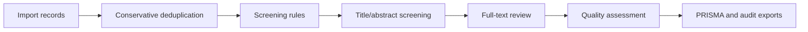

# PRISMA Screening & Audit Workbench

A local-first, research-grade workspace for systematic reviews, meta-analyses, and evidence synthesis. It keeps literature import, conservative deduplication, dual review, quality assessment, history rollback, PRISMA 2020 export, and audit evidence in one browser workflow.

[](LICENSE)
[](https://quzhiii.github.io/-PRISMA-/)
[](https://quzhiii.github.io/-PRISMA-/)
[](./docs/plans/2026-06-03-v2-5-history-rollback.md)
[](./literature-screening-v2.2/)
[](https://quzhiii.github.io/-PRISMA-/)
[](https://quzhiii.github.io/-PRISMA-/)

English | [简体中文](./README.md)

[Live Demo](https://quzhiii.github.io/-PRISMA-/) · [Issues](https://github.com/quzhiii/-PRISMA-/issues) · [Version History](#version-history)

This is for teams that need more than a final PRISMA diagram. It focuses on keeping the review trail explainable:

- Project data stays in the local browser by default.
- Import, deduplication, screening, full-text review, quality appraisal, and export actions leave audit evidence.
- Dual-review conflicts, source-file changes, and accidental workflow changes can be detected, blocked, or rolled back.
- Final outputs are not limited to diagrams and result tables; the workspace can also export audit evidence suited to review, defense, and methods appendices.

## Why use this workspace

The hard part of a systematic review is rarely the final diagram. The hard part is whether the process can be checked later: which records came in, which duplicates were removed, which records were excluded by rules, why full-text records were excluded, how dual-review conflicts were resolved, and whether an earlier screening state can be restored. This project is built around those real workflow risks, not just around producing a final count.

| Review problem | How this workspace handles it |
|---|---|
| Database exports arrive in mixed formats | Supports `CSV / TSV / RIS / ENW / BibTeX / RDF / TXT / NBIB`, including mixed-source imports |
| Automatic deduplication can remove valid records | Separates hard duplicates from candidate duplicates; candidates go to human review |
| Large imports can make the page feel frozen | Common formats use Worker-based incremental parsing with stage, byte, and record progress |
| PRISMA counts are difficult to audit | V2.2 adds `AuditEvent` and `ScreeningDecision`, so counts can be recalculated from durable data |
| Full-text exclusion reasons are scattered across notes | Uses a standard exclusion-reason taxonomy and exports a reason summary |
| Quality appraisal often sits outside screening tools | Included studies can enter item-level quality forms and export quality appraisal, evidence table, and GRADE summary files |
| Dual-review conflicts weaken final export trust | V2.5 brings screening and quality disagreements into reviewer isolation, resolver workflow, agreement metrics, and an unresolved-conflict gate |
| Wrong source files or source-set changes are hard to undo | V2.5.1 adds local project snapshots, restore flow, and source-file add/remove history |
| AI assistance needs transparency before adoption | AI mode is `off` by default; example AI suggestions must pass through human confirmation and audit logs |

## Who it is for

| User | Good fit |
|---|---|
| Medical, nursing, public-health, and management researchers | Screening records and preparing PRISMA outputs for systematic reviews or meta-analyses |
| Research teams and hospital groups | Keeping multi-source database exports local while preserving screening evidence |
| Evidence synthesis and policy researchers | Conservative deduplication, dual-review workflow, quality setup, and audit records |
| Chinese literature database users | Handling CNKI / Wanfang / VIP / PubMed / RIS / RDF export issues |
| Methodology and open-science software authors | Building on tested, benchmarked, audit-ready review infrastructure |

## Workflow at a glance



| Stage | Main output |
|---|---|
| Import | Normalized records, source file metadata, import events |
| Deduplication | Hard-duplicate removals, candidate duplicate list, dedup evidence |
| Rule screening | Title/abstract include, exclude, and uncertain decisions |
| Manual review | Full-text decisions, exclusion reasons, reviewer notes |
| Quality assessment | Study-design suggestions, tool-family suggestions, item-level quality appraisal, evidence baselines |
| Export | PRISMA SVG, result tables, screening report, audit package, quality appraisal, evidence table, GRADE summary, dual-review conflict evidence |

## Current status

| Line | Path | Status |
|---|---|---|
| V2.5 dual-review closeout | `literature-screening-v2.2/` | Current public release line. It formalizes dual full-text review and quality-appraisal disagreements with reviewer isolation, conflict queues, resolver workflow, agreement metrics, conflict evidence exports, and an unresolved-conflict gate; the page shell, project snapshot version, and manifest default version now align on V2.5. |
| V2.5.1 project history rollback | `literature-screening-v2.2/` | Completed. Adds local history snapshots, version restore, recoverable state after source-file changes, and restore points around import, screening rerun, full-text finalization, quality save, conflict resolution, and export. |
| V2.4 quality appraisal | `literature-screening-v2.2/` | Completed stable capability. Keeps V2.3 PRISMA-trAIce transparency and adds quality appraisal templates, reviewer-editable item-level forms, `quality_appraisal.csv`, `evidence_table.csv`, and `grade_summary.csv`. No real AI provider dispatch is enabled by default. The `v2.2` directory remains the compatibility release path. |
| V2.6 | `literature-screening-v2.2/` | Completed: local conservative AI foundation slice. It covers local advisory suggestions, prioritisation, uncertainty flags, prompt-registry trace records, Step 3 advisory queue controls, queue summary, priority sorting, review-state filters, empty-state clarity, PRISMA-trAIce queue summary, and audit summary queue summary; real provider dispatch stays disabled by default and final decisions remain human-confirmed. |
| V2.7 Chinese-source reliability | `literature-screening-v2.2/` | Next: fixture-backed CNKI, Wanfang, VIP, and SinoMed reliability hardening with `abstract_truncation_suspected`, `abstract_noise_detected`, and `source_mapping_incomplete` import warnings; no backend, real AI dispatch, or automatic final screening decisions. |
| V2.3 PRISMA-trAIce readiness | `literature-screening-v2.2/` | Completed AI usage registry, provider boundary, AI suggestion log, human confirmation loop, and transparency report; no real AI provider dispatch is enabled by default. |
| V2.2 audit-ready | `literature-screening-v2.2/` | Completed audit foundation with audit model, workflow events, and audit-package exports |
| V2.1 stable | `literature-screening-v2.0/` | Historical stable path with the six-step workflow and early quality setup |
| v1.7.x | Root legacy entry | Historical maintenance line |

V2.5 closeout turns dual review from a usable entry point into an auditable, risk-gated workflow. V2.5 is now the current public release line in the same `literature-screening-v2.2/` compatibility path, and real AI provider dispatch remains disabled by default. V2.5.1 adds local project history and rollback so users can recover after uploading the wrong files, changing source sets, or needing to inspect an earlier screening pass. Current key exports include:

| File | Purpose |
|---|---|
| `project_manifest.json` | Project metadata, PRISMA version, AI mode, settings |
| `events.jsonl` | Event log for import, deduplication, screening, review, quality, and export actions |
| `screening_decisions.csv` | Durable screening-decision ledger |
| `exclusion_reasons.csv` | Exclusion taxonomy and reason counts |
| `prisma_counts.json` | PRISMA counts recalculated from decisions and events |
| `audit_summary.md` | Human-readable audit summary and notes |
| `ai_usage_registry.json` | AI mode, provider boundary, allowed stages, and acknowledgement evidence |
| `ai_suggestions.jsonl` | AI suggestions, hashes, human review actions, linked decisions, review trace fields, and PRISMA count boundary |
| `PRISMA_TRAICE_REPORT.md` | No-AI or assistive-AI transparency report for PRISMA-trAIce readiness |
| `quality_appraisal.csv` | Study-level and domain-level quality appraisal with human judgement, supporting quote / page, reviewer note, and overall judgement |
| `evidence_table.csv` | Evidence extraction table with PICOS, effect fields, quality judgement, and certainty baseline |
| `grade_summary.csv` | GRADE summary scaffold grouped by outcome and PICOS; final certainty and downgrade reasons remain human-confirmed |
| `dual_review_conflicts.csv` | V2.5 dual-review conflict evidence for screening and quality disagreements, reviewer A/B values, resolver/final values, and status |
| `dual_review_agreement.json` | V2.5 agreement metrics with paired decisions, percent agreement, Cohen's kappa, and conflict gate status |

## Core capabilities

| Capability | Current state |
|---|---|
| Multi-format import | Supports `CSV / TSV / RIS / ENW / BibTeX / RDF / TXT / NBIB` |
| Incremental parsing | `CSV / TSV / RIS / NBIB / ENW` use Worker-based chunk parsing |
| Conservative deduplication | Hard duplicates are auto-removed; candidate duplicates go to review |
| Rule-based screening | Language, year, keyword, title, author, and journal filters |
| Full-text review | Keyboard shortcuts, exclusion reasons, notes, and record-level translation entry |
| Dual review | V2.5 closeout supports A/B decision isolation, conflict queue, resolver workflow, agreement metrics, and unresolved-conflict gate |
| History rollback | V2.5.1 supports local project snapshots, version restore, source-file add/remove history, and restore points at key workflow steps |
| Quality assessment | V2.4 supports template families, item-level forms, human judgement, supporting quote / page, and reviewer notes; V2.5 adds quality conflict handling |
| Evidence synthesis | Supports `quality_appraisal.csv`, `evidence_table.csv`, and `grade_summary.csv` |
| PRISMA 2020 export | Multi-theme SVG, included/excluded tables, and screening report |
| Audit export | Supports manifest, event log, decision ledger, counts, summary, quality audit trace, and dual-review conflict gate events |
| PRISMA-trAIce readiness | Adds AI mode, AI usage registry, provider abstraction, mock suggestion log, human review trace fields, and a transparency report; no real AI provider dispatch is enabled |

## Performance and benchmarks

| Operation | Volume | Result | Notes |
|---|---:|---:|---|
| IndexedDB write | 30,000 records | ~3-5s | Batch insert, 500 records per batch |
| Paginated query | 100 records | ~213ms | Indexed query |
| Virtual list render | 30,000 records | ~16ms/frame | Renders only visible rows |
| Auto-delete precision | benchmark | `1.000` | Conservative policy avoids false auto-deletes |
| Combined Candidate F1 | benchmark | `0.957` | More stable candidate-duplicate output |

Benchmark numbers come from [`docs/benchmarks/dedup/post-implementation-benchmark-report.md`](./docs/benchmarks/dedup/post-implementation-benchmark-report.md). Import speed varies by device, so this README only keeps numbers backed by repository evidence.

## Technical architecture

```text
workspace.html              -> Workspace page and step structure
app.js                      -> Main flow, rule screening, review, export, and state management
audit-engine.js             -> Audit model, PRISMA-trAIce structures, decision serialization, audit-package builders
dual-review-engine.js       -> V2.5 conflict queues, resolver workflow, agreement metrics, and dual-review exports
project-history-engine.js   -> V2.5.1 local history snapshots, state cloning, and rollback metadata
db-worker.js                -> IndexedDB data layer
parser-worker.js            -> Multi-format parsing and background orchestration
streaming-parser.js         -> Incremental parsing state machines
quality-engine.js           -> Quality templates, study design, evidence table, and GRADE summary
import-job-runtime.js       -> Import stages, progress, and project state
dedup-engine.js             -> Conservative deduplication engine
virtual-list.js             -> Large-list rendering
```

## Tests

Regression entry:

```powershell
node tests\run-all-regressions.js
```

Current coverage includes:

- audit model, workflow hooks, audit-package export
- AI suggestion panel, human review flow, PRISMA-trAIce report, and AI suggestion JSONL trace fields
- dual-review conflict queue, resolver workflow, agreement metrics, and unresolved-conflict gate
- project history snapshots, rollback flow, source-file add/remove recovery
- dedup engine, candidate duplicate export, benchmark smoke/regression
- import job state, parser chunk boundaries, import hardening
- quality engine, study-design classifier, quality appraisal CSV, evidence table, and GRADE summary

Latest V2.6 foundation regression result: `151/151` passed.

## Roadmap

| Phase | Goal |
|---|---|
| V2.2 | Audit foundation, event log, recalculable PRISMA counts, audit-package export |
| V2.3 | PRISMA-trAIce readiness: AI usage registry, reviewed AI suggestion log, No-AI/assistive transparency report |
| V2.4 | Completed: quality appraisal templates, item-level forms, evidence table, GRADE summary |
| V2.5 | Current public release line: reviewer isolation, conflict queue, resolver workflow, agreement metrics, unresolved-conflict gate |
| V2.5.1 | Completed: local history records, project snapshots, source-file add/remove rollback, key workflow restore points |
| V2.6 | Completed: local conservative AI foundation slice for advisory suggestions, ranking, prompt registry, provider abstraction boundaries, Step 3 advisory queue controls, PRISMA-trAIce queue summary, and audit summary queue summary |
| V2.7 | Next: Chinese-source reliability with fixture-backed CNKI / Wanfang / VIP / SinoMed hardening, abstract truncation / noise / incomplete-mapping import warnings, and unchanged final-decision semantics |
| V3.0 | Landing page, demo dataset, benchmark, paper skeleton, release material |

## Version history

<details>
<summary><b>V2.6 Conservative AI foundation (completed foundation slice, 2026-06)</b></summary>

- adds a local conservative AI engine that only creates advisory `AISuggestionEvent` records and does not directly create final `ScreeningDecision` records
- adds `priorityScore`, `priorityReason`, `recommendedQueue`, `uncertaintyFlags`, `riskFlags`, and prompt/input hash traces
- adds Step 3 advisory queue controls: queue labels, queue summary, priority sorting, review-state filters, and empty-state clarity
- adds Step 4 queue context handoff / hygiene so human reviewers retain queue context while reviewing records
- adds V2.6 queue controls summaries to the PRISMA-trAIce report and audit summary
- keeps real AI provider dispatch disabled by default, with no API key input, backend account, or cloud sync
- keeps AI suggestions advisory-only until a human accepts or edits them into a countable human `ScreeningDecision`
- full regression passed `151/151`

</details>

<details>
<summary><b>V2.5.1 project history rollback (completed, 2026-06)</b></summary>

- adds `project-history-engine.js` for bounded local project history snapshots
- adds a project history panel and restore entry for earlier screening states
- creates restore points at `before_import`, `after_import`, `screening_rerun`, `fulltext_finalized`, `quality_saved`, `conflict_resolved`, and `before_export`
- adds source-file add/remove history and preserves a recoverable state before source-file removal
- preserves the current full rollback timeline when restoring an older snapshot
- stabilizes fallback audit IDs for records without durable identifiers so source-file removal does not drop surviving decisions, AI suggestions, or quality assessments
- stamps sample-data records with `_source` and `_sourceFile`, so source-file removal also works for built-in sample data
- full regression passed `133/133`

</details>

<details>
<summary><b>V2.5 dual-review closeout (current public release line, 2026-06)</b></summary>

- Reviewer A/B full-text decisions are isolated as durable `ScreeningDecision` records
- Screening conflicts generate a conflict queue across include / exclude / uncertain disagreements
- Resolver actions write final human decisions and `review_conflict_resolved` audit events
- Quality conflicts are detected across overall judgement, status, and domain judgements
- Quality resolver actions write final quality values and `quality_conflict_resolved` audit events
- Added `dual_review_conflicts.csv` and `dual_review_agreement.json`
- Final result exports are blocked while unresolved dual-review conflicts remain; conflict evidence exports remain available
- V2.5 closeout regression passed `121/121`; headless Chrome smoke passed with 0 console errors and 0 runtime exceptions

</details>

<details>
<summary><b>V2.4 quality appraisal (completed stable capability, 2026-05)</b></summary>

- keeps `literature-screening-v2.2/` as the compatibility release path
- adds quality-appraisal template schema for RCT, cohort, case-control, cross-sectional, diagnostic accuracy, and systematic review studies
- adds reviewer-editable item-level quality forms for domain judgement, supporting quote / page, reviewer note, overall judgement, status, and assessment notes
- adds `quality_appraisal.csv`
- adds `evidence_table.csv`
- adds `grade_summary.csv`, with final GRADE certainty and downgrade reasons still human-confirmed
- writes `quality_appraisal_updated` audit events with before / after snapshots
- does not connect a real AI provider by default, and does not save or export API keys
- full regression passed `115/115`

</details>

<details>
<summary><b>V2.3 PRISMA-trAIce readiness (completed, 2026-05)</b></summary>

- adds `off`, `assistive`, and `experimental` AI modes
- adds a provider abstraction layer for future OpenAI-compatible endpoints, with request drafts disabled by default
- exports `ai_usage_registry.json`
- exports `ai_suggestions.jsonl` with human actions, linked decisions, `reviewed_at`, human edit fields, and `prisma_count_boundary`
- exports `PRISMA_TRAICE_REPORT.md` with No-AI and assistive-AI transparency sections
- keeps mock AI suggestions advisory-only until a human accepts or edits them into a `ScreeningDecision`
- keeps rejected suggestions out of PRISMA counts
- does not dispatch to a real AI provider or export API key material
- ships from the `literature-screening-v2.2/` compatibility path while presenting V2.3 as the release version
- tracks the release-readiness gate in [`docs/checklists/V2.3_PRISMA_TRAICE_READINESS_CHECKLIST.md`](docs/checklists/V2.3_PRISMA_TRAICE_READINESS_CHECKLIST.md)

</details>

<details>
<summary><b>V2.2 audit-ready (completed foundation, 2026-04)</b></summary>

- adds the isolated `literature-screening-v2.2/` workspace
- adds `audit-engine.js`
- adds `ProjectManifest`, `AuditEvent`, and `ScreeningDecision`
- records workflow events for import, deduplication, rule screening, full-text review, quality setup, and exports
- normalizes audit event types: automatically maps legacy names to the `AUDIT_LEDGER_DESIGN.md` contract names, keeping legacy data compatible
- exports use a stable `snake_case` field schema (`project_id`, `screening_stage`, `human_decision`, etc.)
- exports the audit package: manifest, events, decisions, exclusion reasons, counts, and summary
- keeps AI mode `off` by default

</details>

<details>
<summary><b>V2.1 stable (historical GitHub Pages path, 2026-04)</b></summary>

- expands the workflow to 6 steps with quality assessment before export
- moves `CSV / TSV / RIS / NBIB / ENW` to Worker-based incremental parsing
- adds `quality-engine.js`, `import-job-runtime.js`, and `streaming-parser.js`
- persists import-job state and the quality queue at project level
- keeps the `literature-screening-v2.0/` path for existing links

</details>

<details>
<summary><b>V2.0 (previous main release, 2026-03)</b></summary>

- added a dedicated homepage, login page, and workspace structure
- added the standalone `dedup-engine.js` deduplication engine
- changed deduplication to hard duplicate auto-removal plus candidate duplicate review
- fixed CSV / TSV multiline abstract parsing
- added record-level translation entry in the full-text review modal
- fixed upload display, page scrolling, step progression, and dual-review shared state

</details>

<details>
<summary><b>v1.7.x (stable maintenance line, 2026-03)</b></summary>

- completed PubMed `.nbib` import support
- fixed single / dual review session wiring
- fixed post-dedup progression into later steps

</details>

## Contributing

Issues and Pull Requests are welcome.

```bash
git checkout -b feature/your-feature
git commit -m "feat: describe your change"
git push origin feature/your-feature
```

## License

[MIT License](./LICENSE)

If this tool helps your research, a Star is welcome.
