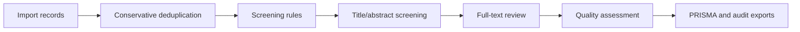

# PRISMA Literature Screening Assistant

A local-first workspace for systematic reviews, meta-analyses, and evidence synthesis. It brings literature import, conservative deduplication, rule-based screening, manual review, quality assessment, PRISMA 2020 export, and audit-package output into one browser workflow.

[](LICENSE)
[](https://quzhiii.github.io/-PRISMA-/)
[](https://quzhiii.github.io/-PRISMA-/)
[](https://quzhiii.github.io/-PRISMA-/)
[](https://quzhiii.github.io/-PRISMA-/)

English | [简体中文](./README.md)

[Live Demo](https://quzhiii.github.io/-PRISMA-/) · [Issues](https://github.com/quzhiii/-PRISMA-/issues) · [Version History](#version-history)

## Why use this workspace

The hard part of a systematic review is rarely the final PRISMA diagram. The hard part is keeping every step explainable: which records came in, which duplicates were removed, which records were excluded by rules, why full-text records were excluded, and whether final counts can be checked later. This project is built around that workflow. It runs locally in the browser by default, which is useful when project data should stay on the researcher's own machine.

| Review problem | How this workspace handles it |
|---|---|
| Database exports arrive in mixed formats | Supports `CSV / TSV / RIS / ENW / BibTeX / RDF / TXT / NBIB`, including mixed-source imports |
| Automatic deduplication can remove valid records | Separates hard duplicates from candidate duplicates; candidates go to human review |
| Large imports can make the page feel frozen | Common formats use Worker-based incremental parsing with stage, byte, and record progress |
| PRISMA counts are difficult to audit | V2.2 adds `AuditEvent` and `ScreeningDecision`, so counts can be recalculated from durable data |
| Full-text exclusion reasons are scattered across notes | Uses a standard exclusion-reason taxonomy and exports a reason summary |
| Quality appraisal often sits outside screening tools | Included studies can enter a quality queue with study-design and evidence baselines |
| AI assistance needs transparency before adoption | AI mode is `off` by default; future AI suggestions must pass through human confirmation and audit logs |

## Who it is for

| User | Good fit |
|---|---|
| Medical, nursing, public-health, and management researchers | Screening records and preparing PRISMA outputs for systematic reviews or meta-analyses |
| Research teams and hospital groups | Keeping multi-source database exports local while preserving screening evidence |
| Evidence synthesis and policy researchers | Conservative deduplication, dual-review workflow, quality setup, and audit records |
| Chinese literature database users | Handling CNKI / Wanfang / VIP / PubMed / RIS / RDF export issues |
| Methodology and open-science software authors | Building on tested, benchmarked, audit-ready review infrastructure |

## Workflow at a glance



| Stage | Main output |
|---|---|
| Import | Normalized records, source file metadata, import events |
| Deduplication | Hard-duplicate removals, candidate duplicate list, dedup evidence |
| Rule screening | Title/abstract include, exclude, and uncertain decisions |
| Manual review | Full-text decisions, exclusion reasons, reviewer notes |
| Quality assessment | Study-design suggestions, tool-family suggestions, evidence baselines |
| Export | PRISMA SVG, result tables, screening report, V2.2 audit package |

## Current status

| Line | Path | Status |
|---|---|---|
| V2.2 audit-ready | `literature-screening-v2.2/` | Current development line with audit model, workflow events, and audit-package exports |
| V2.1 stable | `literature-screening-v2.0/` | Current GitHub Pages stable path with the six-step workflow and quality setup |
| v1.7.x | Root legacy entry | Historical maintenance line |

V2.2 focuses on making the screening workflow auditable as data. Audit event types are normalized to the `AUDIT_LEDGER_DESIGN.md` contract, exports use a stable `snake_case` field schema, and legacy stored data remains compatible. It adds these exports:

| File | Purpose |
|---|---|
| `project_manifest.json` | Project metadata, PRISMA version, AI mode, settings |
| `events.jsonl` | Event log for import, deduplication, screening, review, quality, and export actions |
| `screening_decisions.csv` | Durable screening-decision ledger |
| `exclusion_reasons.csv` | Exclusion taxonomy and reason counts |
| `prisma_counts.json` | PRISMA counts recalculated from decisions and events |
| `audit_summary.md` | Human-readable audit summary and notes |

## Core capabilities

| Capability | Current state |
|---|---|
| Multi-format import | Supports `CSV / TSV / RIS / ENW / BibTeX / RDF / TXT / NBIB` |
| Incremental parsing | `CSV / TSV / RIS / NBIB / ENW` use Worker-based chunk parsing |
| Conservative deduplication | Hard duplicates are auto-removed; candidate duplicates go to review |
| Rule-based screening | Language, year, keyword, title, author, and journal filters |
| Full-text review | Keyboard shortcuts, exclusion reasons, notes, and record-level translation entry |
| Dual review | Main / secondary reviewer mode, with stronger conflict handling planned |
| Quality assessment | Quality queue, study-design suggestions, and evidence baselines |
| PRISMA 2020 export | Multi-theme SVG, included/excluded tables, and screening report |
| Audit export | V2.2 supports manifest, event log, decision ledger, counts, and summary |

## Performance and benchmarks

| Operation | Volume | Result | Notes |
|---|---:|---:|---|
| IndexedDB write | 30,000 records | ~3-5s | Batch insert, 500 records per batch |
| Paginated query | 100 records | ~213ms | Indexed query |
| Virtual list render | 30,000 records | ~16ms/frame | Renders only visible rows |
| Auto-delete precision | benchmark | `1.000` | Conservative policy avoids false auto-deletes |
| Combined Candidate F1 | benchmark | `0.957` | More stable candidate-duplicate output |

Benchmark numbers come from [`docs/benchmarks/dedup/post-implementation-benchmark-report.md`](./docs/benchmarks/dedup/post-implementation-benchmark-report.md). Import speed varies by device, so this README only keeps numbers backed by repository evidence.

## Technical architecture

```text
workspace.html              -> Workspace page and step structure
app.js                      -> Main flow, rule screening, review, export, and state management
audit-engine.js             -> V2.2 audit model, decision serialization, audit-package builders
db-worker.js                -> IndexedDB data layer
parser-worker.js            -> Multi-format parsing and background orchestration
streaming-parser.js         -> Incremental parsing state machines
quality-engine.js           -> Study-design, tool-family, and evidence baselines
import-job-runtime.js       -> Import stages, progress, and project state
dedup-engine.js             -> Conservative deduplication engine
virtual-list.js             -> Large-list rendering
```

## Tests

Regression entry:

```powershell
node tests\run-all-regressions.js
```

Current coverage includes:

- audit model, workflow hooks, audit-package export
- dedup engine, candidate duplicate export, benchmark smoke/regression
- import job state, parser chunk boundaries, import hardening
- quality engine and study-design classifier

## Roadmap

| Phase | Goal |
|---|---|
| V2.2 | Audit foundation, event log, recalculable PRISMA counts, audit-package export |
| V2.3 | PRISMA-trAIce data model, AI usage registry, AI suggestion log, transparent report |
| V2.4 | Quality appraisal templates, evidence table, GRADE summary |
| V2.5 | Reviewer isolation, conflict queue, resolver workflow, agreement metrics |
| V2.6 | Conservative AI screening, ranking, prompt registry, provider abstraction |
| V3.0 | Landing page, demo dataset, benchmark, paper skeleton, release material |

## Version history

<details>
<summary><b>V2.2 audit-ready (current development line, 2026-04)</b></summary>

- adds the isolated `literature-screening-v2.2/` workspace
- adds `audit-engine.js`
- adds `ProjectManifest`, `AuditEvent`, and `ScreeningDecision`
- records workflow events for import, deduplication, rule screening, full-text review, quality setup, and exports
- normalizes audit event types: automatically maps legacy names to the `AUDIT_LEDGER_DESIGN.md` contract names, keeping legacy data compatible
- exports use a stable `snake_case` field schema (`project_id`, `screening_stage`, `human_decision`, etc.)
- exports the audit package: manifest, events, decisions, exclusion reasons, counts, and summary
- keeps AI mode `off` by default

</details>

<details>
<summary><b>V2.1 stable (current GitHub Pages path, 2026-04)</b></summary>

- expands the workflow to 6 steps with quality assessment before export
- moves `CSV / TSV / RIS / NBIB / ENW` to Worker-based incremental parsing
- adds `quality-engine.js`, `import-job-runtime.js`, and `streaming-parser.js`
- persists import-job state and the quality queue at project level
- keeps the `literature-screening-v2.0/` path for existing links

</details>

<details>
<summary><b>V2.0 (previous main release, 2026-03)</b></summary>

- added a dedicated homepage, login page, and workspace structure
- added the standalone `dedup-engine.js` deduplication engine
- changed deduplication to hard duplicate auto-removal plus candidate duplicate review
- fixed CSV / TSV multiline abstract parsing
- added record-level translation entry in the full-text review modal
- fixed upload display, page scrolling, step progression, and dual-review shared state

</details>

<details>
<summary><b>v1.7.x (stable maintenance line, 2026-03)</b></summary>

- completed PubMed `.nbib` import support
- fixed single / dual review session wiring
- fixed post-dedup progression into later steps

</details>

## Contributing

Issues and Pull Requests are welcome.

```bash
git checkout -b feature/your-feature
git commit -m "feat: describe your change"
git push origin feature/your-feature
```

## License

[MIT License](./LICENSE)

If this tool helps your research, a Star is welcome.
