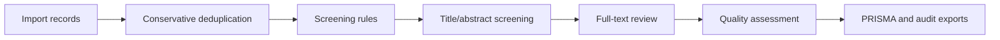

# PRISMA Literature Screening Assistant

A local-first workspace for systematic reviews, meta-analyses, and evidence synthesis. It brings literature import, conservative deduplication, rule-based screening, manual review, quality assessment, PRISMA 2020 export, and audit-package output into one browser workflow.

[](LICENSE)
[](https://quzhiii.github.io/-PRISMA-/)
[](https://quzhiii.github.io/-PRISMA-/)
[](https://quzhiii.github.io/-PRISMA-/)
[](https://quzhiii.github.io/-PRISMA-/)

English | [简体中文](./README.md)

[Live Demo](https://quzhiii.github.io/-PRISMA-/) · [Issues](https://github.com/quzhiii/-PRISMA-/issues) · [Version History](#version-history)

## Why use this workspace

The hard part of a systematic review is rarely the final PRISMA diagram. The hard part is keeping every step explainable: which records came in, which duplicates were removed, which records were excluded by rules, why full-text records were excluded, and whether final counts can be checked later. This project is built around that workflow. It runs locally in the browser by default, which is useful when project data should stay on the researcher's own machine.

| Review problem | How this workspace handles it |
|---|---|
| Database exports arrive in mixed formats | Supports `CSV / TSV / RIS / ENW / BibTeX / RDF / TXT / NBIB`, including mixed-source imports |
| Automatic deduplication can remove valid records | Separates hard duplicates from candidate duplicates; candidates go to human review |
| Large imports can make the page feel frozen | Common formats use Worker-based incremental parsing with stage, byte, and record progress |
| PRISMA counts are difficult to audit | V2.2 adds `AuditEvent` and `ScreeningDecision`, so counts can be recalculated from durable data |
| Full-text exclusion reasons are scattered across notes | Uses a standard exclusion-reason taxonomy and exports a reason summary |
| Quality appraisal often sits outside screening tools | Included studies can enter reviewer-editable item-level quality forms and export quality, evidence, and GRADE tables |
| AI assistance needs transparency before adoption | AI mode is `off` by default; example AI suggestions must pass through human confirmation and audit logs |

## Who it is for

| User | Good fit |
|---|---|
| Medical, nursing, public-health, and management researchers | Screening records and preparing PRISMA outputs for systematic reviews or meta-analyses |
| Research teams and hospital groups | Keeping multi-source database exports local while preserving screening evidence |
| Evidence synthesis and policy researchers | Conservative deduplication, dual-review workflow, quality setup, and audit records |
| Chinese literature database users | Handling CNKI / Wanfang / VIP / PubMed / RIS / RDF export issues |
| Methodology and open-science software authors | Building on tested, benchmarked, audit-ready review infrastructure |

## Workflow at a glance



| Stage | Main output |
|---|---|
| Import | Normalized records, source file metadata, import events |
| Deduplication | Hard-duplicate removals, candidate duplicate list, dedup evidence |
| Rule screening | Title/abstract include, exclude, and uncertain decisions |
| Manual review | Full-text decisions, exclusion reasons, reviewer notes |
| Quality assessment | Study-design suggestions, tool-family suggestions, item-level appraisal, evidence baselines |
| Export | PRISMA SVG, result tables, screening report, audit package, quality appraisal, evidence table, GRADE summary |

## Current status

| Line | Path | Status |
|---|---|---|
| V2.4 quality appraisal | `literature-screening-v2.2/` | Current release line. Keeps V2.3 PRISMA-trAIce transparency and adds quality appraisal templates, reviewer-editable item-level forms, `quality_appraisal.csv`, `evidence_table.csv`, and `grade_summary.csv`. No real AI provider dispatch is enabled by default. The `v2.2` directory remains the compatibility release path. |
| V2.3 PRISMA-trAIce readiness | `literature-screening-v2.2/` | Completed AI usage registry, provider boundary, AI suggestion log, human confirmation loop, and transparency report; no real AI request is sent by default |
| V2.2 audit-ready | `literature-screening-v2.2/` | Completed audit foundation with audit model, workflow events, and audit-package exports |
| V2.1 stable | `literature-screening-v2.0/` | Historical stable path with the six-step workflow and early quality setup |
| v1.7.x | Root legacy entry | Historical maintenance line |

V2.4 is the current public release surface. It preserves the V2.2 audit chain and V2.3 PRISMA-trAIce transparency report while moving included studies into formal quality-appraisal and evidence-table structures. Audit event types are normalized to the `AUDIT_LEDGER_DESIGN.md` contract, exports use a stable `snake_case` field schema, and legacy stored data remains compatible. Current key exports include:

| File | Purpose |
|---|---|
| `project_manifest.json` | Project metadata, PRISMA version, AI mode, settings |
| `events.jsonl` | Event log for import, deduplication, screening, review, quality, and export actions |
| `screening_decisions.csv` | Durable screening-decision ledger |
| `exclusion_reasons.csv` | Exclusion taxonomy and reason counts |
| `prisma_counts.json` | PRISMA counts recalculated from decisions and events |
| `audit_summary.md` | Human-readable audit summary and notes |
| `ai_usage_registry.json` | AI mode, provider boundary, allowed stages, and acknowledgement evidence |
| `ai_suggestions.jsonl` | AI suggestions, hashes, human review actions, linked decisions, review trace fields, and PRISMA count boundary |
| `PRISMA_TRAICE_REPORT.md` | No-AI or assistive-AI transparency report for PRISMA-trAIce readiness |
| `quality_appraisal.csv` | Per-study and per-domain quality appraisal rows with human-entered judgement, supporting quote/page, reviewer note, and overall judgement |
| `evidence_table.csv` | PICOS, effect, quality judgement, and certainty-of-evidence table for evidence synthesis |
| `grade_summary.csv` | Outcome/PICOS-grouped GRADE scaffold; final certainty and downgrade reasons remain human-confirmed |

## Core capabilities

| Capability | Current state |
|---|---|
| Multi-format import | Supports `CSV / TSV / RIS / ENW / BibTeX / RDF / TXT / NBIB` |
| Incremental parsing | `CSV / TSV / RIS / NBIB / ENW` use Worker-based chunk parsing |
| Conservative deduplication | Hard duplicates are auto-removed; candidate duplicates go to review |
| Rule-based screening | Language, year, keyword, title, author, and journal filters |
| Full-text review | Keyboard shortcuts, exclusion reasons, notes, and record-level translation entry |
| Dual review | Main / secondary reviewer mode, with stronger conflict handling planned |
| Quality assessment | V2.4 supports template families, item-level forms, human judgement, supporting quote/page, and reviewer note fields |
| Evidence formalization | Exports `quality_appraisal.csv`, `evidence_table.csv`, and `grade_summary.csv` |
| PRISMA 2020 export | Multi-theme SVG, included/excluded tables, and screening report |
| Audit export | Supports manifest, event log, decision ledger, counts, summary, and quality-appraisal audit traces |
| PRISMA-trAIce readiness | Adds AI mode, AI usage registry, provider abstraction, mock suggestion log, human review trace fields, and a transparency report; no real AI provider dispatch is enabled |

## Performance and benchmarks

| Operation | Volume | Result | Notes |
|---|---:|---:|---|
| IndexedDB write | 30,000 records | ~3-5s | Batch insert, 500 records per batch |
| Paginated query | 100 records | ~213ms | Indexed query |
| Virtual list render | 30,000 records | ~16ms/frame | Renders only visible rows |
| Auto-delete precision | benchmark | `1.000` | Conservative policy avoids false auto-deletes |
| Combined Candidate F1 | benchmark | `0.957` | More stable candidate-duplicate output |

Benchmark numbers come from [`docs/benchmarks/dedup/post-implementation-benchmark-report.md`](./docs/benchmarks/dedup/post-implementation-benchmark-report.md). Import speed varies by device, so this README only keeps numbers backed by repository evidence.

## Technical architecture

```text
workspace.html              -> Workspace page and step structure
app.js                      -> Main flow, rule screening, review, export, and state management
audit-engine.js             -> Audit model, PRISMA-trAIce structures, decision serialization, audit-package builders
db-worker.js                -> IndexedDB data layer
parser-worker.js            -> Multi-format parsing and background orchestration
streaming-parser.js         -> Incremental parsing state machines
quality-engine.js           -> Quality templates, study-design detection, evidence table, and GRADE summary
import-job-runtime.js       -> Import stages, progress, and project state
dedup-engine.js             -> Conservative deduplication engine
virtual-list.js             -> Large-list rendering
```

## Tests

Regression entry:

```powershell
node tests\run-all-regressions.js
```

Current coverage includes:

- audit model, workflow hooks, audit-package export
- AI suggestion panel, human review flow, PRISMA-trAIce report, and AI suggestion JSONL trace fields
- dedup engine, candidate duplicate export, benchmark smoke/regression
- import job state, parser chunk boundaries, import hardening
- quality engine, study-design classifier, quality appraisal CSV, evidence table, and GRADE summary

Latest V2.4 closeout regression: `115/115` tests passed.

## Roadmap

| Phase | Goal |
|---|---|
| V2.2 | Audit foundation, event log, recalculable PRISMA counts, audit-package export |
| V2.3 | PRISMA-trAIce readiness: AI usage registry, reviewed AI suggestion log, No-AI/assistive transparency report |
| V2.4 | Completed: quality appraisal templates, item-level forms, evidence table, GRADE summary |
| V2.5 | In progress: reviewer isolation, conflict queue, resolver workflow, agreement metrics |
| V2.6 | Conservative AI screening, ranking, prompt registry, provider abstraction |
| V3.0 | Landing page, demo dataset, benchmark, paper skeleton, release material |

## Version history

<details>
<summary><b>V2.4 quality appraisal (current release, 2026-05)</b></summary>

- keeps `literature-screening-v2.2/` as the compatibility release path
- adds a quality appraisal template schema covering RCT, cohort, case-control, cross-sectional, diagnostic accuracy, and systematic review studies
- adds reviewer-editable item-level quality forms for domain judgement, supporting quote/page, reviewer note, overall judgement, appraisal status, and assessment notes
- exports `quality_appraisal.csv`
- exports `evidence_table.csv`
- exports `grade_summary.csv`, while final GRADE certainty and downgrade reasons remain human-confirmed
- records quality edits as `quality_appraisal_updated` audit events with before/after values
- does not connect to a real AI provider by default and does not save or export API keys
- passed the full regression suite, `115/115`

</details>

<details>
<summary><b>V2.3 PRISMA-trAIce readiness (completed, 2026-05)</b></summary>

- adds `off`, `assistive`, and `experimental` AI modes
- adds a provider abstraction layer for future OpenAI-compatible endpoints, with request drafts disabled by default
- exports `ai_usage_registry.json`
- exports `ai_suggestions.jsonl` with human actions, linked decisions, `reviewed_at`, human edit fields, and `prisma_count_boundary`
- exports `PRISMA_TRAICE_REPORT.md` with No-AI and assistive-AI transparency sections
- keeps mock AI suggestions advisory-only until a human accepts or edits them into a `ScreeningDecision`
- keeps rejected suggestions out of PRISMA counts
- does not dispatch to a real AI provider or export API key material
- tracks the release-readiness gate in [`docs/checklists/V2.3_PRISMA_TRAICE_READINESS_CHECKLIST.md`](docs/checklists/V2.3_PRISMA_TRAICE_READINESS_CHECKLIST.md)

</details>

<details>
<summary><b>V2.2 audit-ready (completed foundation, 2026-04)</b></summary>

- adds the isolated `literature-screening-v2.2/` workspace
- adds `audit-engine.js`
- adds `ProjectManifest`, `AuditEvent`, and `ScreeningDecision`
- records workflow events for import, deduplication, rule screening, full-text review, quality setup, and exports
- normalizes audit event types: automatically maps legacy names to the `AUDIT_LEDGER_DESIGN.md` contract names, keeping legacy data compatible
- exports use a stable `snake_case` field schema (`project_id`, `screening_stage`, `human_decision`, etc.)
- exports the audit package: manifest, events, decisions, exclusion reasons, counts, and summary
- keeps AI mode `off` by default

</details>

<details>
<summary><b>V2.1 stable (historical GitHub Pages path, 2026-04)</b></summary>

- expands the workflow to 6 steps with quality assessment before export
- moves `CSV / TSV / RIS / NBIB / ENW` to Worker-based incremental parsing
- adds `quality-engine.js`, `import-job-runtime.js`, and `streaming-parser.js`
- persists import-job state and the quality queue at project level
- keeps the `literature-screening-v2.0/` path for existing links

</details>

<details>
<summary><b>V2.0 (previous main release, 2026-03)</b></summary>

- added a dedicated homepage, login page, and workspace structure
- added the standalone `dedup-engine.js` deduplication engine
- changed deduplication to hard duplicate auto-removal plus candidate duplicate review
- fixed CSV / TSV multiline abstract parsing
- added record-level translation entry in the full-text review modal
- fixed upload display, page scrolling, step progression, and dual-review shared state

</details>

<details>
<summary><b>v1.7.x (stable maintenance line, 2026-03)</b></summary>

- completed PubMed `.nbib` import support
- fixed single / dual review session wiring
- fixed post-dedup progression into later steps

</details>

## Contributing

Issues and Pull Requests are welcome.

```bash
git checkout -b feature/your-feature
git commit -m "feat: describe your change"
git push origin feature/your-feature
```

## License

[MIT License](./LICENSE)

If this tool helps your research, a Star is welcome.
